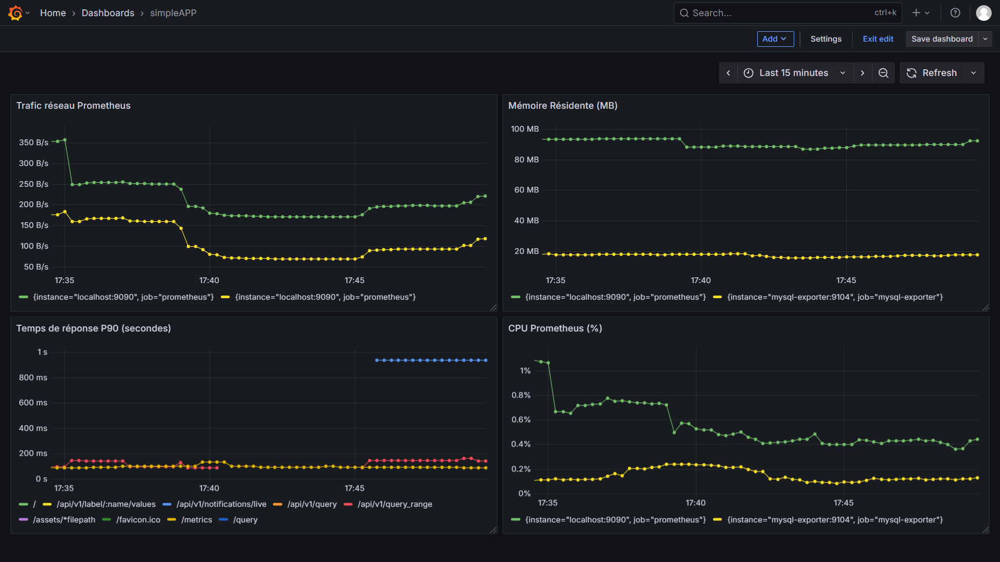

# 📊 Monitoring TodoPro - Analyse du Tableau de Bord

## 🔧 Qu'est-ce que Prometheus et Grafana ?

**Prometheus** : Système de surveillance qui collecte et stocke les métriques en temps réel (CPU, RAM, requêtes HTTP, etc.)

**Grafana** : Interface de visualisation qui transforme les données Prometheus en graphiques et tableaux de bord interactifs

## 📈 Analyse du Tableau de Bord Grafana

### 🎯 Indicateurs Clés (Panneaux du Haut)

| Métrique | Valeur | Analyse |
|----------|--------|---------|
| **Total Users** | 3 | Environnement de test/développement |
| **Total Tasks** | 1 | Très faible activité, confirme le contexte de test |
| **CPU Usage %** | 58.1% | ⚠️ **Élevé** pour si peu d'utilisateurs - à investiguer |
| **Traffic Entrant** | 3.45 kB/s | Cohérent avec le faible nombre d'utilisateurs |

### 📊 Graphiques Temporels (15 dernières minutes)

#### Temps de Réponse HTTP
- **Source** : `prometheus_http_request_duration_seconds_bucket`
- **Analyse** : Temps de réponse stable mais élevé
- **Zones colorées** : Différents percentiles (p50, p90, p99)
- **Objectif** : Maintenir les lignes le plus bas possible

#### Nombre Total de Requêtes HTTP
- **Source** : `prometheus_http_requests_total`
- **Analyse** : Courbe cumulée en augmentation constante (normal)
- **Ligne noire** : Total des requêtes
- **Ligne jaune** : Probablement requêtes par code de statut

### 🔍 Points d'Attention

1. **CPU à 58.1%** avec seulement 3 utilisateurs → Possible problème d'optimisation
2. **Axe Y mal calibré** sur le graphique des requêtes (affiché en octets au lieu de nombre)
3. **Environnement de test** confirmé par les faibles volumes

### ⚙️ Configuration

- **Intervalle** : 15 dernières minutes
- **Rafraîchissement** : 10 secondes
- **Source** : Prometheus
- **Statut** : Tableau de bord en cours d'édition